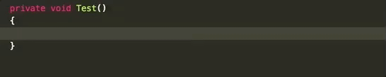
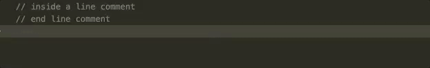
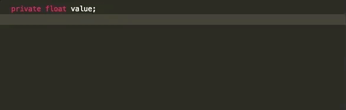
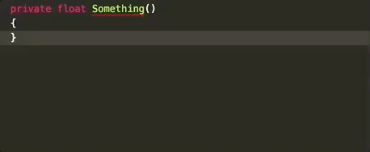

# Smart Semicolon Extension

This extension places semicolons at the end of an expression.

## Semantic Detection

This extension detects line comments and language brackets and configures the end of the current expression.

Line Detection

Bracket Detection

## Automatic Line Change

When enabled, this extension automatically inserts a new line below the current cursor and put the cursor at the beginning of the new line on a semicolon key. The exceptions are when:

- If the current line is the only line inside a code block.
- If the below line is a code.
- If the current line has a close bracket after this expression.
- If the current line contains any of `autoLineChangeExceptionKeywords` (for example, you don't want to insert a new line after `return`, `throw` keywords in C#).

In case you don't want the newly-inserted line, simply putting another semicolon will cancel the insertion, and the cursor goes back to the previous position.

## Extension Settings

* `smartsemicolon.enable`: enable this extension on/off.
* `smartsemicolon.autoLineChange`: enable the automatic line changing feature on/off.
* `smartsemicolon.languages`: set of languages where this extension will take actions.

## Known Issues

- Cannot detect multi-lined comments. To insert a semicolon inside a multi-lined comment, users must manually toggle the extension off.
- Users must provide information about languages where this extension will take actions. Currently, extensions cannot retrieve language configurations from the Visual Studio Code.

### 1.0.0

Initial release 